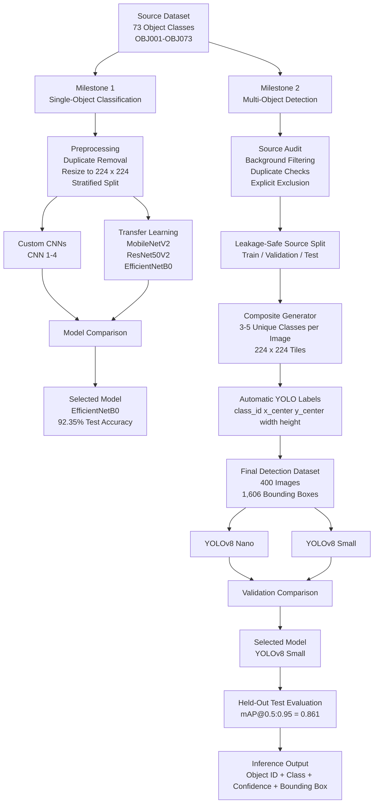

# IE7615 Deep Learning for AI

Group project for **IE7615 Deep Learning for AI**. This repository contains two related computer vision milestones built on a shared dataset of 73 everyday object classes:

- **Milestone 1:** single-object image classification with custom CNNs and transfer learning
- **Milestone 2:** multi-object detection with YOLOv8 on programmatically generated composite images

## Team

- Hemanth Rajaboyina
- Jaya Raghu Ram Penugonda
- Nikhil Kudupudi
- Sri Lakshmi Swetha Jalluri

## Project Overview

Milestone 1 establishes the image-classification baseline. Four CNNs trained from scratch are compared with MobileNetV2, ResNet50V2, and EfficientNetB0. EfficientNetB0 is selected as the final classifier.

Milestone 2 extends the same object set to detection. Source images are audited and split before composite generation, 3–5 distinct object classes are placed into each composite, YOLO labels are created automatically during generation, and YOLOv8 Nano and Small models are fine-tuned and compared. YOLOv8 Small is selected using validation performance and then evaluated on the held-out test set.

---


## Architecture




## Milestone 1 — Object Classification

### Dataset

- 73 object classes (`OBJ001`–`OBJ073`)
- 7,343 original images
- 7,315 images after exact duplicate removal
- RGB images resized to 224 × 224
- Stratified train/validation/test split: **5,120 / 1,097 / 1,098**
- Random seed: **42**

### Models

**Custom CNNs**
- CNN 1
- CNN 2
- CNN 3
- CNN 4

**Transfer-learning models**
- MobileNetV2
- ResNet50V2
- EfficientNetB0

### Results

| Model | Type | Validation Accuracy | Test Accuracy |
|---|---|---:|---:|
| CNN 1 | Custom CNN | 60.0% | 61.2% |
| CNN 2 | Custom CNN | 63.0% | 63.0% |
| CNN 3 | Custom CNN | 63.1% | 62.9% |
| CNN 4 | Custom CNN | 66.5% | 68.1% |
| MobileNetV2 | Transfer learning | 88.3% | 89.8% |
| ResNet50V2 | Transfer learning | 89.2% | 90.4% |
| **EfficientNetB0** | **Transfer learning** | **91.52%** | **92.35%** |

**Selected model:** EfficientNetB0

---

## Milestone 2 — Multi-Object Detection

### Source Audit

The original source dataset is audited before composite generation. Background-only images are excluded from the object pool, exact duplicates are handled, and `images_OBJ054/OBJ054_017.jpg` is explicitly excluded.

Final source counts:

- Included image files: **7,342**
- Object images: **6,957**
- Background-only images: **385**
- Unique usable object images after duplicate handling: **6,941**

### Leakage-Safe Source Split

Source images are split before composites are generated so that the same source image, or an exact duplicate, cannot appear across train, validation, and test composites.

| Split | Source Images |
|---|---:|
| Train | 4,822 |
| Validation | 1,019 |
| Test | 1,100 |
| **Total** | **6,941** |

All 73 classes are represented in every split. The final checks confirm no source-path overlap and no MD5-hash overlap across splits.

### Composite Dataset

The final detection dataset contains **400 composite images** with **1,606 annotations**.

| Split | Images | Bounding Boxes |
|---|---:|---:|
| Train | 280 | 1,122 |
| Validation | 60 | 247 |
| Test | 60 | 237 |
| **Total** | **400** | **1,606** |

Object count per composite:

| Objects per Image | Images |
|---|---:|
| 3 | 132 |
| 4 | 130 |
| 5 | 138 |

Each composite uses unique object classes and one of the following layouts:

- **3 objects:** 2 × 2 grid, 448 × 448 canvas, one empty cell
- **4 objects:** 2 × 2 grid, 448 × 448 canvas
- **5 objects:** 2 × 3 grid, 672 × 448 canvas, one empty cell

Each source image is fitted to a **224 × 224** tile before being pasted into the composite.

### YOLO Labels

Labels are generated automatically in the same process that creates the composites:

```text
class_id x_center y_center width height
```

Coordinates are normalized to the final canvas dimensions. YOLO class IDs `0`–`72` map to canonical object IDs `OBJ001`–`OBJ073`.

The bounding box corresponds to the full 224 × 224 pasted source-image region. It is therefore a region-level box and can include some background around the physical object.

### Dataset Validation

Before training, the generated dataset is checked for:

- matching image/label pairs
- valid YOLO formatting and normalized coordinates
- boxes contained within image boundaries
- 3–5 annotations per image
- unique classes within each composite
- valid class IDs and representation of all 73 classes
- expected train/validation/test counts
- no source-image reuse or source-hash reuse
- no cross-split leakage
- absence of the explicitly excluded source image

All final validation checks pass.

### YOLOv8 Training

Two COCO-pretrained YOLOv8 variants are fine-tuned directly on the generated detection dataset:

- YOLOv8 Nano (`yolov8n.pt`)
- YOLOv8 Small (`yolov8s.pt`)

Training configuration:

| Parameter | Value |
|---|---|
| Epochs | 50 |
| Early-stopping patience | 10 |
| Input size | 640 |
| Batch size | 16 |
| Random seed | 42 |
| Deterministic training | Enabled |
| Ultralytics | 8.4.174 |
| Training hardware | NVIDIA Tesla T4 |

### Validation Results

| Model | Precision | Recall | mAP@0.5 | mAP@0.5:0.95 |
|---|---:|---:|---:|---:|
| YOLOv8 Nano | 0.662 | 0.533 | 0.632 | 0.614 |
| **YOLOv8 Small** | **0.890** | **0.836** | **0.897** | **0.896** |

YOLOv8 Small is selected using validation performance only.

### Held-Out Test Results

After model selection, YOLOv8 Small is evaluated on the held-out test split of **60 images / 237 object instances**.

| Metric | Result |
|---|---:|
| Precision | **0.833** |
| Recall | **0.801** |
| mAP@0.5 | **0.861** |
| mAP@0.5:0.95 | **0.861** |

### Inference Output

The inference pipeline reports the canonical object ID, object name, confidence score, and bounding-box coordinates `(x1, y1, x2, y2)`.

Example:

```text
OBJ071 | Sloth Plushie | confidence=0.996 | bbox=(223.8, 0.2, 447.9, 223.8)
OBJ069 | Knife | confidence=0.991 | bbox=(0.0, 0.0, 223.6, 223.4)
OBJ073 | Bowl | confidence=0.974 | bbox=(0.0, 223.9, 223.6, 448.0)
OBJ034 | Table Tennis Racket | confidence=0.939 | bbox=(224.1, 223.7, 447.9, 448.0)
```

---

## Repository Structure

```text
IE7615-Deep-Learning-for-AI/
├── images_OBJ001/
├── ...
├── images_OBJ073/
├── object_names.csv
├── requirements.txt
├── 1_data_loading_and_preprocessing.ipynb
├── 2_simple_cnn.ipynb
├── 3_pretrained_models.ipynb
├── 4_test_and_results.ipynb
├── results/
└── milestone2/
    ├── configs/
    │   └── data.yaml
    ├── metadata/
    │   ├── class_distribution.csv
    │   ├── composite_manifest.csv
    │   ├── duplicate_report.csv
    │   ├── source_manifest.csv
    │   └── source_split_manifest.csv
    ├── notebooks/
    │   └── milestone2_yolov8_object_detection.ipynb
    ├── results/
    │   └── final/
    │       ├── report_figures/
    │       ├── yolov8n/
    │       └── yolov8s/
    └── src/
        ├── audit_source_dataset.py
        ├── create_source_splits.py
        ├── generate_final_dataset.py
        ├── validate_yolo_dataset.py
        └── visualize_annotations.py
```

Generated datasets, trained model weights, and other large intermediate files are intentionally not committed to the repository.

---

## Setup

Clone the repository and install the project dependencies:

```bash
git clone https://github.com/pjraghuram/IE7615-Deep-Learning-for-AI.git
cd IE7615-Deep-Learning-for-AI

python3 -m venv .venv
source .venv/bin/activate
pip install -r requirements.txt
```

For Milestone 2, the final experiments use:

```bash
pip install ultralytics==8.4.174
```

---

## Reproducing Milestone 1

Run the root notebooks in order:

1. `1_data_loading_and_preprocessing.ipynb`
2. `2_simple_cnn.ipynb`
3. `3_pretrained_models.ipynb`
4. `4_test_and_results.ipynb`

These notebooks cover preprocessing, CNN experiments, transfer learning, model comparison, and final evaluation.

---

## Reproducing Milestone 2

From the repository root:

```bash
python milestone2/src/audit_source_dataset.py
python milestone2/src/create_source_splits.py
python milestone2/src/generate_final_dataset.py
python milestone2/src/validate_yolo_dataset.py
```

Then run:

```text
milestone2/notebooks/milestone2_yolov8_object_detection.ipynb
```

The notebook contains the final YOLOv8 training, validation comparison, held-out test evaluation, inference examples, and artifact export.

---

## Final Models

| Milestone | Selected Model | Final Evaluation |
|---|---|---|
| Milestone 1 | EfficientNetB0 | 92.35% test accuracy |
| Milestone 2 | YOLOv8 Small | 0.861 test mAP@0.5:0.95 |

## Repository

https://github.com/pjraghuram/IE7615-Deep-Learning-for-AI
